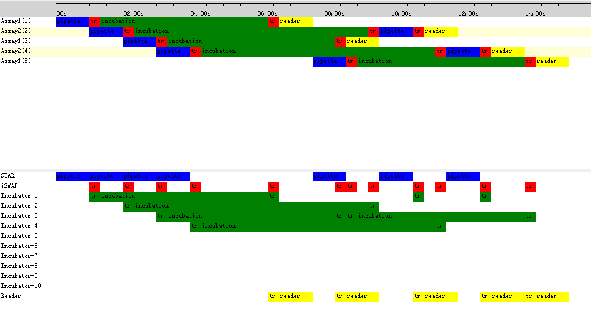

# SchedulerEngineDotNet
This is a scheduler engine for robot control in C#. With it you can easily enable your software processing multiple tasks or assays parallelly on multiple instruments.

# How to use it,

1. Create the scheduler engine
```csharp
SchedulerEngineEx scheduler = new SchedulerEngineEx();
```
2. Define the resource (like instrument) and number
```csharp
            scheduler.Register("STAR", 1, Color.Blue.ToArgb());
            scheduler.Register("iSWAP", 1, Color.Red.ToArgb());
            scheduler.Register("Incubator", 10, Color.Green.ToArgb());
            scheduler.Register("Reader", 1, Color.Yellow.ToArgb());
```
3. Define the protocol of assay
```csharp
    class Task1 : TaskEx
    {
        public override void Run()
        {
            StartTask("Assay1");
            Activity("pipette", 60, new string[] { "STAR" }, new int[] { 1 }, Color.Blue, () =>
            {
                        //write your code here to control your instrument
            });
            Activity("transport", 20, new string[] { "iSWAP", "Incubator" }, new int[] { 1, 1 }, Color.Red, () => { 
            });
            Activity("incubation", 300, new string[] { "Incubator" }, new int[] { 1 }, Color.Green, () =>
            {
            });
            Activity("transport", 20, new string[] { "iSWAP", "Incubator", "Reader" }, new int[] { 1, 1, 1 }, Color.Red,()=>{
            });
            Activity("reader", 60, new string[] { "Reader" }, new int[] { 1 }, Color.Yellow, () =>
            {
            });            
            EndTask();
        }
    }
```    
4. activate the assay and schedule the workflow
```csharp
 scheduler.Activate(new Task1());
 ```
 5. start running
 ```csharp
 scheduler.Run();
 ```
 The scheduler can monitor and change the workflow realtime.
 
 we also write a simple GUI to display the task and resource, which can easily shown in the WinForm
 ```csharp
 Scheduler.SchedulerView view = new Scheduler.SchedulerView();
 view.Init(scheduler);
 ```
 # ScreenShot
 
